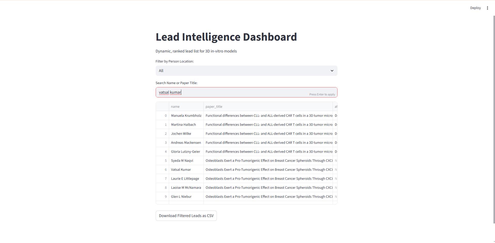
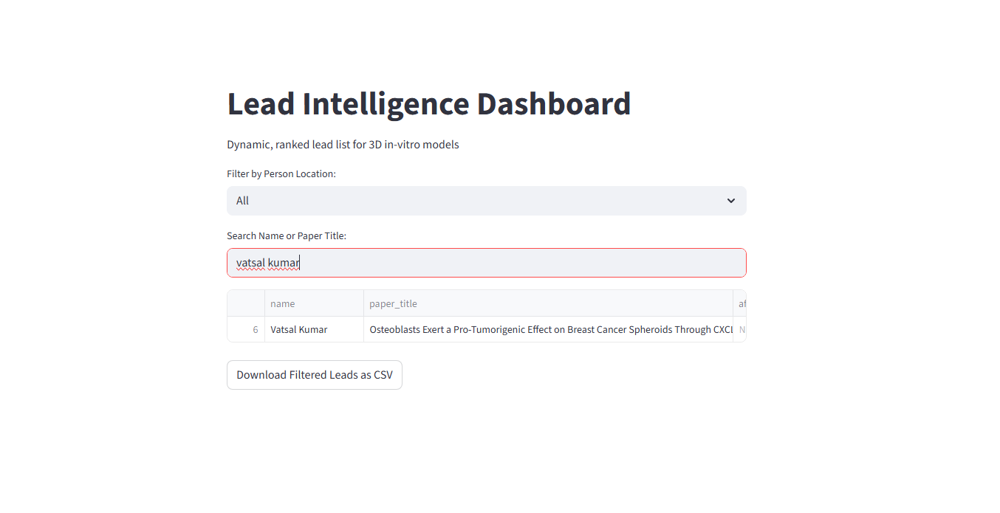

## Overview
This project is a **prototype web agent** designed to identify, enrich, and rank scientific and industry professionals for 3D in-vitro models in therapeutic research.

It demonstrates:
- PubMed data ingestion
- Author-level lead generation
- Enrichment with emails and locations (heuristic placeholders)
- Rule-based probability scoring
- Interactive Streamlit dashboard

---

## Features
1. **Lead Extraction:** Converts papers into individual leads.
2. **Enrichment:** Adds placeholder emails, person locations, and company HQ.
3. **Scoring:** Assigns a probability score (0–100) and ranks leads.
4. **Dashboard:** Searchable, filterable table with CSV download.

---

## How to Run

1. Clone repo or download zip
2. Install Python 3.10+ and required packages:

```bash
pip install -r requirements.txt

## Notes
- Emails are placeholders generated from author names and affiliations.
- Locations are heuristics based on affiliation.
- Company HQ is a placeholder equal to person location.
- LinkedIn / paid enrichment APIs are not used in this prototype.
- Designed for Internshala internship submission.


## Screenshots


=======
# lead-intelligence-agent-demo
>>>>>>> f73cf02c1b701744d87e5f14b28ef5b4bc2e97d1
